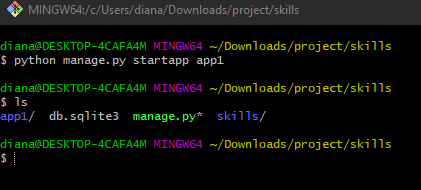

## Backend(Python) con Django - Sesion 1

Para generar un entorno virtual seguimos los siguientes pasos:

1. Pipenv administra las dependencias por proyecto, por lo que es mejor usar Pipenv dentro del directorio de su proyecto. Para instalar paquetes, cambie al directorio de su proyecto y ejecute:
   
       $ cd project 
       $ pipenv install requests

  

2. Esto generará dos archivos 
   
   
   
   el archivo pipfile mostrara los paquetes que vayamos instalando (django, python 3.10. En este caso)
   
   

Para generar el proyecto:

1.     $ django-admin startproject nameProject

        

        Genera un archivo manage.py (Para ver el arbol de directorios los visializamos en en el VSC)

        

2. Configurar zona horaria según su ubicaicón [List of tz database time zones - Wikipedia ](https://en.wikipedia.org/wiki/List_of_tz_database_time_zones). En el archivo settings.py
   
   

3. Correr el proyecto (detener el proyecto Ctrl + C)
   
       $ python manage.py runserver 0:8000

4. Realizar migraciones
   
       python manage.py migrate

        

5.     Vamos a una nueva pestaña de nuestro navegador, y colocamos *localhost:8000*
   
   

6. Administrador
   
   

7. Crear un usuario
   
       $ winpty python manage.py createsuperuser

        

    Coloque antes el winpty en caso de recibir este mensaje al crear el usuario con la     siguiente sentencia:

     $ python manage.py createsuperuser
    Superuser creation skipped due to not running in a TTY. You can run `manage.py createsuperuser` in your project to create one manually.
    
    

8. Volver a correr el servidor y colocamos nuestros datos del usuario que acabamos de crear y entraremos al adm

Crear aplicación

    $ python manage.py startapp app1

Generar tres app

